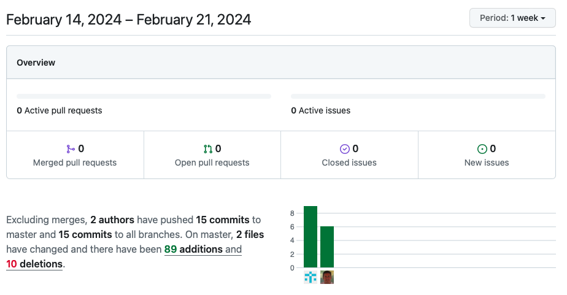
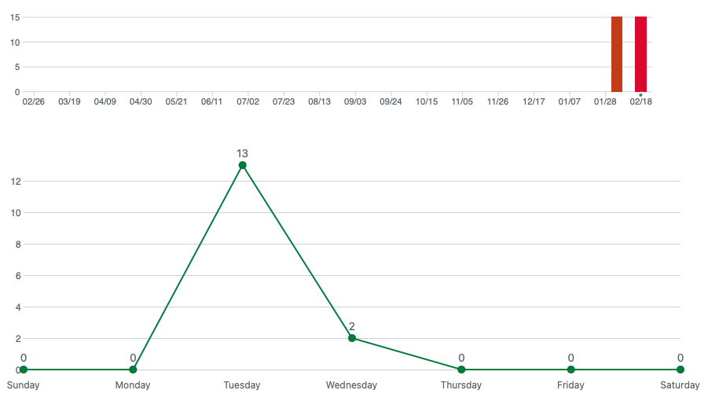
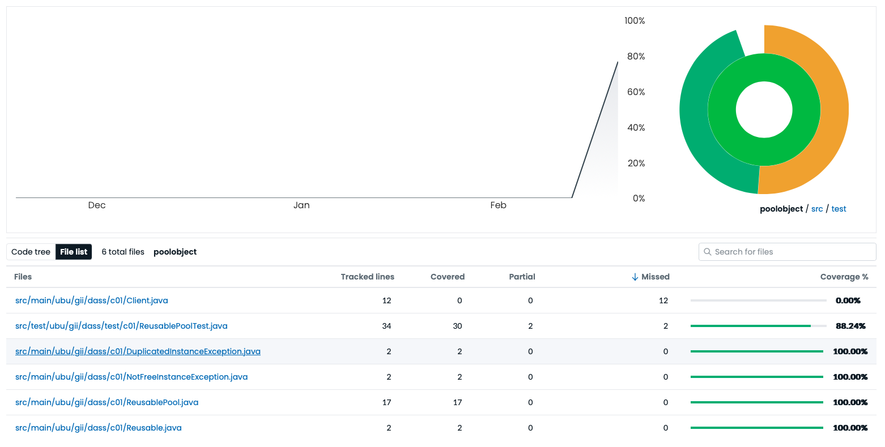

poolobject
==========

Java code example of creational design pattern pool object

Workshop to use good practices in software developmemnt: testing and measurement.

## Autores

- [Víctor Manuel Vaquero Mesa](mailto:vvm1002@alu.ubu.es)
- [Juan José Santos Cambra](mailto:jsc1013@alu.ubu.es)

## Objetivos
- Comprender los objetivos de medición relacionados con la caracterización y la evaluación de productos, procesos y recursos software
- Comprender, aplicar y analizar técnicas de medición sobre entidades de productos software relacionados con conjuntos de pruebas de software
- Comprender, aplicar y analizar medidas relacionadas sobre entidades de proceso y recursos de prueba del software

## Requisitos

### Requisitos Software
- Eclipse IDE for Java Developers http://www.eclipse.org/downloads/
- Plugin Eclipse EclEmma http://www.eclemma.org/ . Manual de instalación. Instalar directamente de la red http://update.eclemma.org/
- Estar registrado con el nombre usuario de la UBU en repositorio de proyectos GitHub https://github.com/
- Estar registrado con la cuenta de Github en Travis CI https://travis-ci.org/ o si se prefiere utilizar el equivalente github actions ant 
- Estar registrado con la cuenta de Github en Codecov.io https://codecov.i

### Requisitos Teóricos
- Conocimiento del proceso de prueba y sus tareas asociadas (Junit y Eclemma)
- Conocimiento de métricas de producto y de proceso
- Conocimiento del patrón de diseño Pool Object
- Conocimiento de gestión ágil en repositorios de proyectos software (Github o GitLab)
- Conocimiento de sistemas de control de versiones (git)
- Conocimientos de sistemas integración continua on cloud (git actions o Travis y codecov)
- Conocimiento de sistemas que permitan la ejecución de tareas del proceso de desarrollo software (ant o maven).

### Requisitos Técnicos
- Manejo de entorno de desarrollo Eclipse y componentes adicionales (plugins)
- Compilar, ejecutar pruebas y desplegar la aplicación con Apache Ant (http://ant.apache.org/) y su integración continua (CI) en entornos oncloud (Travis o Github actions
- Desarrollo de proyectos software con el sistema de control de versiones Git: clonación de repositorios, commit, push ...
- Automatización de casos de prueba con JUnit 4 (Manual de usuario)
- Cobertura del código con las pruebas usando EclEmma, JaCoCo y Codecov.io.

## Enunciado
En la práctica se va simular un pequeño desarrollo de un producto software para realizar mediciones sobre él.
El objetivo es establecer un caso de estudio dummy que sirva para caracterizar y evaluar tanto el producto
desarrollado como el proceso seguido.

## Preguntas
A continuación se tratará de dar respuesta a las siguientes preguntas:

### 1. ¿Se ha realizado trabajo en equipo?

Sí, se ha realizado el trabajo en equipo intercalando commits y en sesiones de trabajo conjuntas mediante el programa de Microsoft Teams haciendo programación por parejas.
El KPI para visualiza el trabajo en equipo se muestra en la siguiente imagen:

Figura 1: Resumen del trabajo realizado

Figura 2: Número de commits realizados a lo largo de la vida del proyecto

### 2. ¿Tiene calidad el conjunto de pruebas disponibles?

Según Codecov tenemos una cobertura de código superior al 81%, donde el causante del porcentaje restante es la clase Client.java, la cual, solo contiene la función main sobre la que no se ha pedido realizar los test.

Figura 2: Número de commits realizados a lo largo de la vida del proyecto

### 3. ¿Cuál es el esfuerzo invertido en realizar la actividad?

La realización de esta práctica nos ha llevado 5 horas en la tarde del martes 20, y 3 horas en la tarde del miercoles 21 de febrero.

### 4. ¿Cuál es el número de fallos encontrados en el código?

En lo relativo a ReusablePoolTest no se han encontrado fallos.
Como podemos ver en la integración continua de Codecov, no se indican errores.

Solo se han encontrado problemas en el Client.java pero no es del ámbito de esta práctica.